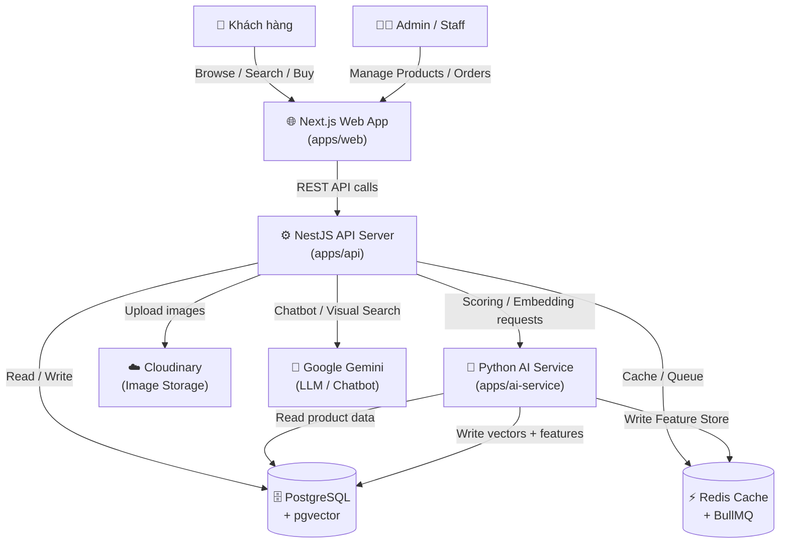
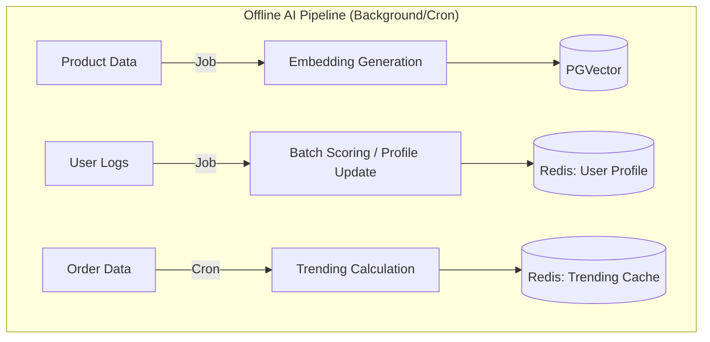
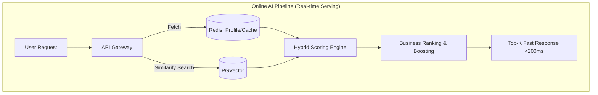
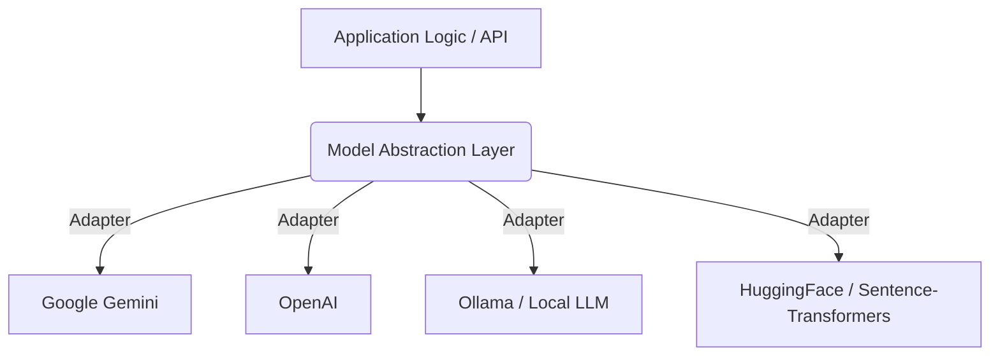
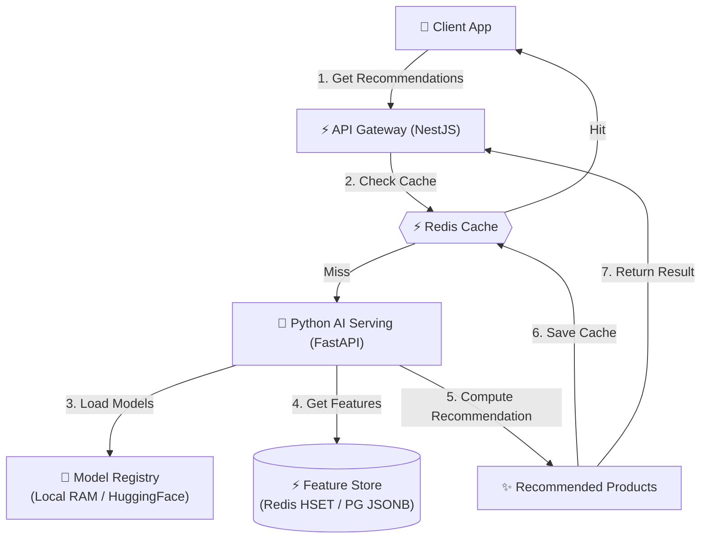
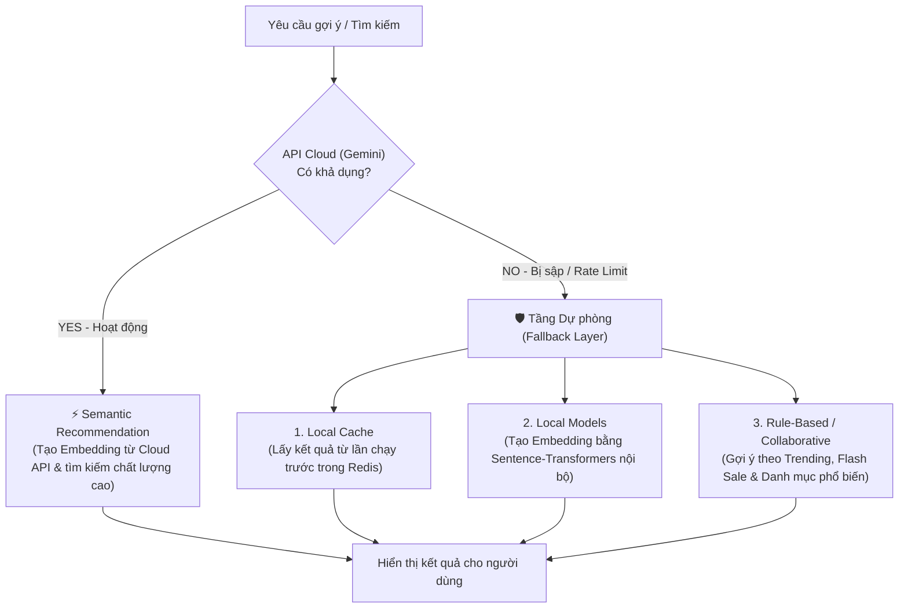
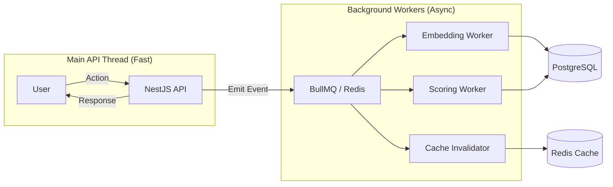
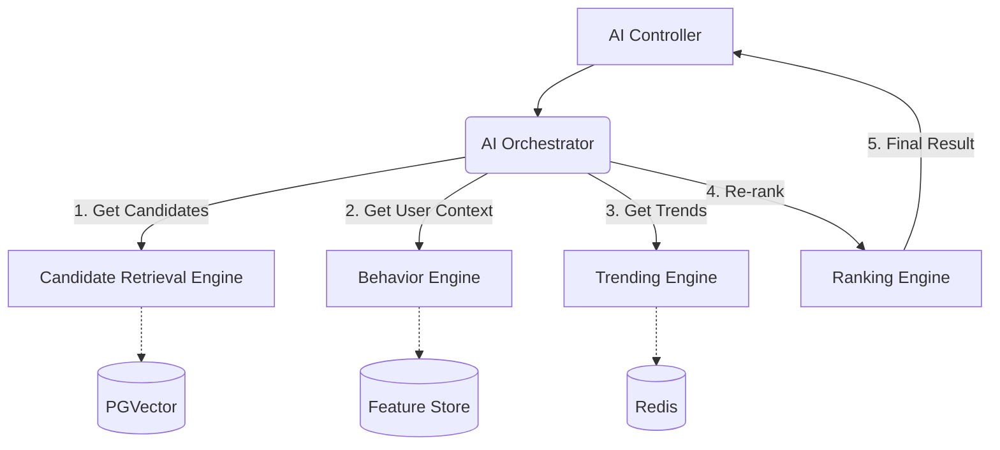
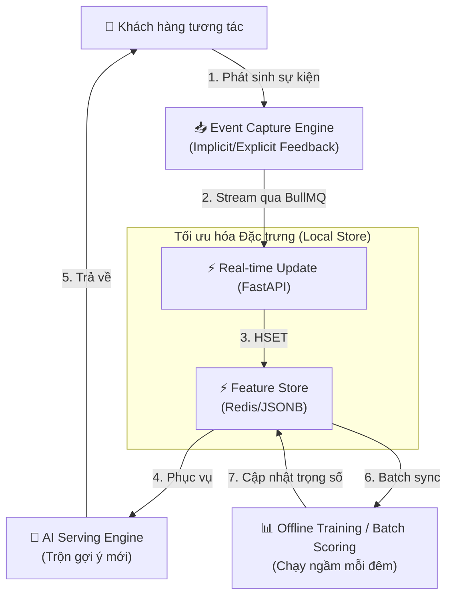

# Hệ thống Gợi ý Sản phẩm Lai (Hybrid Recommendation System) - SneakFreak

## 1. Tổng quan
Trong đồ án **SneakFreak**, hệ thống AI không chỉ dừng lại ở một Chatbot hỗ trợ mà được phát triển thành một **Hệ thống Gợi ý Sản phẩm Lai (Hybrid Recommendation System)**. Mục tiêu là cá nhân hóa trải nghiệm người dùng, giúp họ tìm thấy sản phẩm yêu thích một cách nhanh chóng và chính xác nhất dựa trên cả đặc điểm sản phẩm và hành vi cá nhân.

---

## 1.1. Sơ đồ Bối cảnh Hệ thống (System Context Diagram)

Sơ đồ này mô tả **toàn bộ hệ thống ở cấp độ cao nhất (Bird's-eye view)** — thể hiện rõ mối quan hệ và trao đổi dữ liệu giữa Người dùng (Actors), các ứng dụng chính (Apps), và các hệ thống bên ngoài (External Services).



**Chú thích các luồng chính:**

| Luồng | Từ | Đến | Mô tả |
| :--- | :--- | :--- | :--- |
| **User Flow** | Khách hàng | Web App → API | Mua sắm, tìm kiếm, nhận gợi ý |
| **AI Chatbot Flow** | API | Gemini | Xử lý hội thoại ngôn ngữ tự nhiên (Cloud) |
| **AI Scoring Flow** | API | AI Service | Tính điểm gợi ý, Embedding (Local Python) |
| **Data Flow** | API + AI Service | PostgreSQL | Lưu trữ sản phẩm, Vector, Feature Store |
| **Cache Flow** | API + AI Service | Redis | Cache kết quả, Queue tác vụ bất đồng bộ |

## 2. Phân định vai trò: AI Layer vs. LLM Layer

Một điểm quan trọng trong đồ án là việc phân định rõ ràng giữa tầng logic AI nội tại và việc sử dụng các mô hình ngôn ngữ lớn (LLM). Hệ thống **không** chỉ đơn thuần là một "wrapper" gọi API mà là một kiến trúc AI hoàn chỉnh.

| Thành phần | Vai trò của LLM (Gemini) | Vai trò của SneakFreak AI System |
| :--- | :--- | :--- |
| **Dữ liệu (Data)** | **Semantic Encoding:** Chuyển đổi mô tả sản phẩm sang Vector. | **Feature Engineering:** Thiết kế cấu trúc dữ liệu, nhãn và thuộc tính sản phẩm. |
| **Logic (Algorithm)** | **Embedding Generation:** Cung cấp mô hình toán học để tạo vector. | **Recommendation Logic:** Thuật toán Hybrid, Scoring Engine, Candidate Retrieval. |
| **Xếp hạng (Ranking)** | Không tham gia. | **Ranking Layer:** Kết hợp Business Logic (Stock, Sale, Popularity) để xếp hạng. |
| **Cá nhân hóa** | Không tham gia. | **Personalization:** Theo dõi hành vi người dùng, quản lý Feedback Loop và cập nhật Profile. |

---

## 3. Kiến trúc Kỹ thuật Chi tiết (AI Pipeline)

Hệ thống AI được thiết kế theo mô hình Pipeline khép kín từ khâu thu thập dữ liệu đến khi đưa ra kết quả gợi ý.

### A. Phân tách Offline và Online Pipeline
Hệ thống AI được thiết kế chia làm 2 luồng rõ rệt: **Offline AI Pipeline** (xử lý ngầm các tác vụ nặng) và **Online AI Pipeline** (phục vụ kết quả theo thời gian thực). Nguyên tắc cốt lõi: *"Các tác vụ nặng được xử lý offline để tối ưu latency cho online serving."*

#### 1. Offline AI Pipeline (Xử lý nền)
Đảm nhiệm các tác vụ đòi hỏi nhiều tài nguyên tính toán (CPU/GPU) và có độ trễ cao. Không ảnh hưởng đến trải nghiệm của người dùng trên web.
- **Training & Cập nhật mô hình:** Huấn luyện lại trọng số nếu cần.
- **Embedding Generation:** Biến đổi thông tin sản phẩm mới thành Vector và lưu vào `pgvector` thông qua `BullMQ`.
- **Trending Calculation:** Chạy cron job định kỳ tính toán điểm xu hướng (Trending Score) cho toàn hệ thống và lưu vào Redis.
- **Batch Scoring:** Cập nhật đồng loạt hồ sơ sở thích (User Interest Profile) của người dùng dựa trên hành vi của họ trong ngày.



#### 2. Online AI Pipeline (Phục vụ thời gian thực)
Đảm nhiệm việc lấy dữ liệu đã được tính toán sẵn từ Offline Pipeline để trộn, sắp xếp và trả về cho Client trong chưa tới 200ms.
- **Real-time Recommendation:** Trả về danh sách gợi ý "Dành cho bạn" (For You) ngay khi mở trang chủ.
- **Session Recommendation:** Dựa vào sản phẩm khách đang xem ngay lúc đó để điều chỉnh kết quả gợi ý.
- **Similar Products / Visual Search:** Tìm kiếm các sản phẩm tương đồng dựa trên khoảng cách Vector trong `pgvector`.



### B. Tầng Trừu tượng hóa Mô hình (Model Abstraction Layer / AI Gateway)
Để tránh việc hệ thống bị phụ thuộc cứng (Vendor Lock-in) vào một nhà cung cấp LLM cụ thể (hiện tại là Gemini), kiến trúc AI được thiết kế bổ sung một **Model Abstraction Layer**. Tầng này đóng vai trò như một Adapter (Cầu nối) giữa ứng dụng và các mô hình AI.



**Lợi ích của Model Abstraction Layer:**
1.  **Tránh Vendor Lock-in:** Code nghiệp vụ (Business Logic) không cần quan tâm nó đang gọi Gemini hay OpenAI.
2.  **Linh hoạt chuyển đổi (Plug-and-Play):** Cho phép dễ dàng chuyển đổi từ Gemini sang OpenAI hoặc chuyển các tác vụ nhúng (Embedding) về chạy hoàn toàn dưới dạng Local Model (như HuggingFace/Ollama) chỉ bằng cách đổi biến môi trường, mà không phải đập đi viết lại code.
3.  **Quản lý lỗi & Fallback:** Nếu Gemini bị sập hoặc quá tải (Rate limit), Adapter có thể tự động gọi sang OpenAI hoặc Local Model để hệ thống không bị gián đoạn.

### C. Kho lưu trữ Đặc trưng (Feature Store)
Để hệ thống AI có thể gợi ý cá nhân hóa (Personalization) chính xác, chúng ta không thể chỉ truy vấn dữ liệu thô từ database (như bảng `Order`, `Cart`). Hệ thống cần một **Feature Store** (Kho lưu trữ Đặc trưng) đóng vai trò chuẩn bị sẵn các "nguyên liệu" cho thuật toán chấm điểm.

Các đặc trưng (Features) được tính toán Offline và lưu trữ tại Feature Store bao gồm:
- **`user_interest_score`**: Điểm số quan tâm chung của người dùng.
- **`category_affinity`**: Mức độ yêu thích đối với từng danh mục (ví dụ: Running: 0.8, Lifestyle: 0.2).
- **`brand_affinity`**: Mức độ yêu thích thương hiệu (ví dụ: Nike: 0.7, Adidas: 0.3).
- **`purchase_frequency`**: Tần suất mua hàng.
- **`session_behavior`**: Hành vi trong phiên làm việc hiện tại (Click, Hover, View time).

**Cách triển khai (Implementation):**
- **Redis Hash (`HSET`):** Dùng để lưu trữ các đặc trưng cần truy xuất siêu tốc (Real-time serving) như `session_behavior` hoặc `category_affinity` của user đang online.
- **PostgreSQL (`JSONB`):** Dùng để lưu trữ dài hạn (Cold storage) các đặc trưng đã tính toán, làm nguồn dữ liệu gốc (Source of truth) để đồng bộ lên Redis hoặc dùng cho Batch Scoring.

**Lợi ích:** Việc áp dụng tư duy "Feature Store" giúp chuẩn hóa quy trình AI Engineering, tách bạch việc *chuẩn bị dữ liệu* và *sử dụng dữ liệu*, giúp các thuật toán Scoring trở nên cực kỳ rõ ràng, dễ giải thích (Explainable AI) và tái sử dụng được ở nhiều chức năng khác nhau.

### D. Kiến trúc Phục vụ AI (AI Serving Architecture)
Để vận hành hệ thống AI hiệu quả ở môi trường thực tế với lượng truy cập cao, kiến trúc phục vụ (AI Serving Architecture) được thiết kế nhằm đạt được 3 tiêu chí: **Độ trễ thấp (Low Latency)**, **Khả năng chịu tải cao (High Throughput)**, và **Độ tin cậy tốt (Reliability)**.



**Chi tiết các thành phần trong kiến trúc Phục vụ:**

1. **Tầng Caching & Shielding (Redis Serving Cache):**
   - Đóng vai trò là tấm khiên bảo vệ các dịch vụ tính toán phía sau.
   - Khoảng **80% yêu cầu lặp lại** sẽ được giải quyết trực tiếp tại Redis (O(1) latency < 5ms) mà không cần đánh động đến AI Service để chạy lại thuật toán Inference (Suy luận).

2. **Tầng Serving Engine (FastAPI + Uvicorn):**
   - Được triển khai dưới dạng một Service độc lập chạy bằng **FastAPI** và Web Server **Uvicorn** (hỗ trợ bất đồng bộ hoàn toàn cực tốt).
   - Tự động nạp sẵn các mô hình nhúng (Sentence-Transformers) vào bộ nhớ RAM của container khi start để đảm bảo không bị lag trong lần đầu chạy (Cold inference).

3. **Luồng Serving Bất đồng bộ (Async Queue Serving):**
   - Với các tác vụ tốn quá nhiều tài nguyên (như xử lý ảnh cho Visual Search), NestJS sẽ không chờ đồng bộ mà đẩy công việc vào hàng đợi **BullMQ**.
   - AI Serving Service sẽ lấy công việc ra xử lý ngầm và cập nhật kết quả lại DB, sau đó API sẽ thông báo cho Client qua **Websockets** để hiển thị kết quả.

**Ý nghĩa đối với Luận văn:**
Sự hiện diện của "AI Serving Architecture" thể hiện tư duy thiết kế hệ thống quy mô lớn (Enterprise-grade System Design), giải quyết triệt để bài toán thắt cổ chai về mặt hiệu năng của các mô hình AI khi đưa ra thực tế (Productionization of ML).

### E. Kiến trúc Dự phòng (Fallback Architecture - Graceful Degradation)
Một hệ thống e-commerce thực tế không bao giờ được phép dừng hoạt động hay hiển thị trang trống khi các API bên ngoài gặp sự cố (downtime). Để tăng cường tính sẵn sàng (High Availability) và khả năng phục hồi (Resilience), hệ thống áp dụng cơ chế **Suy giảm chất lượng dịch vụ có kiểm soát (Graceful Degradation)** thông qua một **Fallback Architecture**.



**Chi tiết các mức dự phòng:**

1. **Cấp độ 1 - Local Semantic Fallback (Mô hình Local thay thế):**
   - Nếu API Gemini không phản hồi khi tạo Embedding cho sản phẩm mới, hệ thống tự động fallback qua **Model Abstraction Layer** để gọi dịch vụ nhúng local chạy bằng **Sentence-Transformers** trên `apps/ai-service`. Mặc dù độ hiểu ngữ nghĩa có thể giảm nhẹ nhưng dịch vụ tìm kiếm tương đồng vẫn hoạt động bình thường mà không tốn chi phí mạng.

2. **Cấp độ 2 - Cached Results Fallback (Tận dụng bộ nhớ đệm):**
   - Nếu cả cụm AI Service gặp sự cố ngắt kết nối, API Gateway sẽ tự động trích xuất các kết quả gợi ý cũ đã lưu trong Redis Cache từ phiên làm việc trước đó của người dùng.

3. **Cấp độ 3 - Rule-based & Collaborative Fallback (Dự phòng thô):**
   - Trong trường hợp tệ nhất khi cả Cache và AI Service đều không thể truy cập, hệ thống sẽ tự động hạ cấp xuống thuật toán cơ bản: hiển thị các sản phẩm đang có chương trình **Flash Sale**, **Trending** (bán chạy nhất toàn sàn) hoặc các sản phẩm có cùng danh mục phổ biến của user. Trang web đảm bảo không bao giờ hiện màn hình trắng hoặc báo lỗi 500 cho khách hàng.

**Lợi ích thiết kế:**
Cơ chế Graceful Degradation là minh chứng cho một kiến trúc phần mềm thực chiến, đảm bảo trải nghiệm khách hàng liên tục tuyệt đối, tránh tổn thất doanh thu do lỗi hệ thống bên thứ ba gây ra. Đây là chủ đề được đánh giá cực kỳ cao ở phần thiết kế vận hành của đồ án.

---

## 4. Kiến trúc Xử lý Bất đồng bộ (Asynchronous & Event-Driven)

Để đảm bảo trải nghiệm người dùng mượt mà, hệ thống tách biệt hoàn toàn luồng xử lý nghiệp vụ chính và luồng xử lý AI thông qua cơ chế hướng sự kiện (Event-Driven).

### A. Sơ đồ tách biệt luồng (Decoupling)


### B. Lợi ích của kiến trúc này
1.  **Non-blocking:** Người dùng không phải chờ AI tính toán xong mới nhận được phản hồi (ví dụ: Thêm vào giỏ hàng chỉ mất vài ms).
2.  **Fault Tolerance:** Nếu Worker gặp sự cố, luồng mua hàng chính vẫn hoạt động bình thường. Worker có thể thử lại (Retry) sau đó.
3.  **Scalability:** Có thể tăng số lượng Worker độc lập với API Server khi lượng dữ liệu AI tăng đột biến.

---

## 5. Luồng dữ liệu & Dịch vụ (Flows)

### A. Data Flow (Luồng dữ liệu)
Luồng di chuyển của dữ liệu từ khi người dùng tương tác đến khi nhận được gợi ý:

1.  **Event Capture:** Người dùng thực hiện hành động (Xem, Mua, Thích) trên Web App.
2.  **API Ingestion:** NestJS API nhận request, thực hiện tác vụ nghiệp vụ và gửi sự kiện sang AI Module.
3.  **Vector Processing:** 
    *   Nếu là sản phẩm mới: Chuyển text sang Vector via Gemini.
    *   Nếu là hành vi: Cập nhật "User Interest Profile".
4.  **Similarity Search:** Khi cần gợi ý, hệ thống thực hiện truy vấn Vector (Cosine Similarity) trong PostgreSQL để tìm các bản ghi gần nhất.
5.  **Ranking & Filtering:** Trộn kết quả và trả về cho Client.

### B. Service Flow: Kiến trúc AI Orchestrator
Thay vì dồn toàn bộ logic vào một `RecommendationService` khổng lồ ("all-in-one"), hệ thống áp dụng mẫu thiết kế **AI Orchestrator**. Orchestrator đóng vai trò như một "nhạc trưởng", điều phối các Engine chuyên trách bên dưới để tổng hợp kết quả.

**Các Engine chuyên trách bao gồm:**
1.  **Candidate Retrieval Engine:** Chịu trách nhiệm truy vấn tập sản phẩm ứng viên (Ví dụ: 100 sản phẩm giống nhất từ `pgvector`).
2.  **Behavior Engine:** Chịu trách nhiệm phân tích lịch sử, trích xuất `user_interest_score` từ Feature Store.
3.  **Trending Engine:** Chịu trách nhiệm cung cấp danh sách sản phẩm đang Hot để mix vào kết quả nếu người dùng thiếu dữ liệu (Cold Start).
4.  **Ranking Engine:** Chịu trách nhiệm áp dụng các luật kinh doanh (Còn hàng, Đang Sale) để sắp xếp lại tập ứng viên.
5.  **LLM Service:** Chịu trách nhiệm xử lý ngôn ngữ tự nhiên (Chatbot, trích xuất từ khóa).



**Lợi ích:**
- **Single Responsibility Principle (SRP):** Tách bạch trách nhiệm rõ ràng, dễ dàng viết Unit Test cho từng Engine.
- **Giống kiến trúc Production:** Đây là thiết kế chuẩn mực của các hệ thống Recommendation System lớn (như Netflix, Spotify), nơi quá trình "Retrieval" (Lọc thô) tách biệt hoàn toàn với "Ranking" (Lọc tinh).

---

## 6. Kiến trúc Hệ thống Hybrid (Nguyên lý)

Hệ thống kết hợp hai phương pháp tiếp cận phổ biến nhất trong AI Recommendation:

### A. Content-Based Filtering (Gợi ý dựa trên nội dung)
- **Cơ chế:** Phân tích các đặc tính vật lý và phi vật lý của sản phẩm (tên, mô tả, màu sắc, phong cách, chất liệu).
- **Công nghệ:** Sử dụng **Vector Embeddings** thông qua Gemini AI hoặc các mô hình mã hóa ngôn ngữ để chuyển đổi thông tin sản phẩm thành các vector toán học.
- **Tính năng liên quan:** 
    - **Visual Search:** Tìm kiếm sản phẩm bằng hình ảnh (đã triển khai).
    - **Similar Products:** Gợi ý các sản phẩm có "khoảng cách vector" gần nhất với sản phẩm đang xem.

### B. Behavior-Based Filtering (Gợi ý dựa trên hành vi)
- **Cơ chế:** Phân tích các hành động của người dùng (Implicit Feedback) thay vì chỉ dựa trên đánh giá sao (Explicit Feedback).
- **Dữ liệu đầu vào:**
    - Lịch sử đơn hàng (`Orders`).
    - Sản phẩm trong giỏ hàng (`Carts`).
    - Sản phẩm trong danh sách yêu thích (`Wishlists`).
    - Lịch sử xem sản phẩm và đánh giá (`Reviews`).

---

## 7. Quy trình Xử lý (Workflow)

### Bước 1: Thu thập & Số hóa dữ liệu (Data Ingestion)
- Mỗi khi một sản phẩm mới được tạo hoặc cập nhật, hệ thống sẽ gọi `EmbeddingService` để tạo ra một **Product Embedding** và lưu vào bảng `product_embeddings`.
- Hệ thống ghi nhận mọi hành vi của người dùng (thêm vào giỏ, yêu thích, mua hàng) vào database.

### Bước 2: Tính toán điểm số (Scoring Engine)
Hệ thống tính điểm quan tâm của người dùng đối với từng thuộc tính sản phẩm:
- **Mua hàng:** +10 điểm.
- **Thêm vào giỏ hàng:** +5 điểm.
- **Thêm vào yêu thích:** +3 điểm.
- **Xem sản phẩm:** +1 điểm.

### Bước 3: Thuật toán Trộn (Hybrid Logic)
Công thức tính điểm gợi ý cơ bản ($S_{base}$):
$$S_{base} = \alpha \cdot S_{content} + \beta \cdot S_{behavior}$$

### Bước 4: Lớp Xếp hạng & Tối ưu (Ranking Layer)
Sau khi có danh sách ứng viên từ bước 3, hệ thống áp dụng các trọng số kinh doanh (Business Boosting) để đưa ra kết quả cuối cùng:

1.  **Popularity Score:** Tăng điểm cho các sản phẩm có `totalSold` cao hoặc đang là xu hướng.
2.  **Inventory Score:** 
    *   Giảm điểm các sản phẩm sắp hết hàng (Stock < 5).
    *   Ẩn các sản phẩm hết hàng (Stock = 0).
3.  **Flash Sale Boost:** Ưu tiên các sản phẩm đang có chương trình khuyến mãi hoặc giảm giá sâu.

Công thức cuối cùng:
$$S_{final} = S_{base} \cdot (1 + \sum Boost)$$

---

## 7.5. Kỹ thuật AI Nâng cao (Advanced Algorithms)

### A. Multi-Stage Recommendation (Gợi ý đa tầng lọc)
Hệ thống nâng cấp từ quy trình 2 bước đơn giản (Retrieve → Rank) thành một pipeline **4 tầng lọc** chuyên nghiệp. Mỗi tầng tiếp nhận đầu vào từ tầng trước và tinh lọc kỹ hơn:

```
Candidate Generation  →  Filtering  →  Ranking  →  Re-ranking
(~1000 candidates)      (~200 left)   (~50 left)   (~10 final)
```

| Tầng | Mục tiêu | Kỹ thuật áp dụng |
| :--- | :--- | :--- |
| **Candidate Generation** | Lấy tập ứng viên rộng | Vector Similarity Search (pgvector) |
| **Filtering** | Loại bỏ sản phẩm không hợp lệ | Lọc theo Stock, Gender, Price Range |
| **Ranking** | Chấm điểm và sắp xếp | Hybrid Score (Content × Behavior) |
| **Re-ranking** | Điều chỉnh lần cuối | Business Boosting (Sale, Trending, Diversity) |

Việc tách nhiều tầng giúp giảm thiểu chi phí tính toán (tầng đầu dùng thuật toán nhanh, tầng cuối dùng thuật toán chính xác) — đây là thiết kế chuẩn mực của Google, YouTube, Netflix.

---

### B. Diversity Layer (Tầng Đa dạng hóa kết quả)
Nếu không có Diversity Layer, hệ thống dễ rơi vào "Filter Bubble": hiển thị 10 sản phẩm Nike màu đen liên tiếp vì người dùng đã xem Nike. Điều này gây ra trải nghiệm nhàm chán dù điểm số cao.

**Công thức Diversity Scoring:**

Sau khi Ranking Engine tạo ra danh sách, Diversity Layer sẽ duyệt từng sản phẩm theo thuật toán **Maximal Marginal Relevance (MMR)**:
- Sản phẩm tiếp theo được chọn phải vừa có **điểm cao** vừa **khác biệt** với các sản phẩm đã chọn.
- Kiểm soát đa dạng theo: **Brand** (≤ 3 Nike trong top 10), **Category** (≤ 4 cùng danh mục), **Color** (≤ 2 màu giống nhau).

**Cấu hình:**
```json
{
  "max_same_brand": 3,
  "max_same_category": 4,
  "diversity_weight": 0.3
}
```

---

### C. Context-Aware Recommendation (Gợi ý theo Ngữ cảnh)
Thay vì chỉ dựa vào lịch sử mua hàng cố định, hệ thống kết hợp thêm các tín hiệu **ngữ cảnh thời gian thực** để điều chỉnh kết quả động:

| Ngữ cảnh | Tín hiệu | Hành động |
| :--- | :--- | :--- |
| **Thời gian trong ngày** | Buổi tối (19h-24h) | Ưu tiên Lifestyle Shoes, giảm Running |
| **Mùa / Thời tiết** | Gần Tết Nguyên Đán | Boost sản phẩm màu đỏ, đen phong cách |
| **Flash Sale đang chạy** | `isOnSale = true` | Tăng điểm gấp đôi cho sản phẩm đang giảm giá |
| **Session hiện tại** | Vừa xem Adidas Superstar | Boost thêm các sản phẩm Adidas trong kết quả |
| **Trending tại thời điểm** | Hành vi toàn hệ thống gần nhất | Chèn xen kẽ sản phẩm Hot vào danh sách |

Kỹ thuật này tương tự thuật toán **Context-aware CF** của Shopee và **"In the moment" Recommendations** của TikTok.

---

### D. Explainable Recommendation (Gợi ý có giải thích)
**Explainability** (Tính minh bạch) là một tiêu chí chất lượng quan trọng trong AI hiện đại. Thay vì trả về một danh sách sản phẩm như một "hộp đen", hệ thống lưu lại metadata về **lý do** mỗi sản phẩm được gợi ý.

**Payload trả về (API Response):**
```json
{
  "product": "Nike Air Force 1",
  "score": 0.87,
  "explanation": {
    "primary_reason": "Bạn đã xem Nike Air Max (sản phẩm tương tự)",
    "supporting_reasons": [
      "Sản phẩm đang trending trong 24h qua",
      "Phong cách Low-Top tương tự sản phẩm bạn đã mua",
      "Thương hiệu Nike chiếm 70% lịch sử yêu thích của bạn"
    ],
    "score_breakdown": {
      "content_score": 0.72,
      "behavior_score": 0.85,
      "trending_boost": 0.15,
      "diversity_penalty": -0.05
    }
  }
}
```

**Hiển thị trên UI:**
> 💡 *Gợi ý vì:*
> - Bạn đã xem Nike Air Force
> - Sản phẩm đang trending
> - Phong cách tương tự sản phẩm đã mua

**Lợi ích học thuật:** Explainable AI (XAI) là một chủ đề nghiên cứu đang rất được quan tâm. Triển khai tính năng này thể hiện ý thức về "Responsible AI" và "Transparent AI" — hai giá trị cốt lõi của AI engineering hiện đại mà hội đồng phản biện rất đánh giá cao.

---

## 8. Tối ưu hiệu năng với Redis & BullMQ

Để đảm bảo hệ thống có khả năng phản hồi nhanh (Latency thấp) và xử lý tải lớn, Redis và BullMQ đóng vai trò xương sống trong kiến trúc AI.

### A. Vai trò của Redis (Multi-purpose Cache)
Không chỉ đơn thuần là cache kết quả, Redis được sử dụng cho 4 mục đích chiến lược:
1.  **Recommendation Result Cache:** Lưu trữ kết quả gợi ý cuối cùng cho từng User (TTL 30-60 phút) để tránh tính toán lại nhiều lần.
2.  **Trending Products Storage:** Lưu trữ danh sách sản phẩm xu hướng được tính toán định kỳ, giúp truy xuất với tốc độ O(1).
3.  **Session-based Context:** Lưu trữ hành vi trong phiên làm việc hiện tại của người dùng chưa đăng nhập để đưa ra gợi ý ngay lập tức.
4.  **Behavior Buffering:** Lưu trữ tạm thời các hành vi click/view trước khi đồng bộ vào Database chính.

### B. Xử lý bất đồng bộ với BullMQ (Queue Worker)
Việc gọi API AI (Gemini) hoặc tính toán Vector rất tốn tài nguyên và thời gian. Hệ thống sử dụng BullMQ để:
- **Queue Embedding Jobs:** Khi thêm 100 sản phẩm mới, hệ thống đẩy vào hàng đợi và xử lý dần thông qua Worker, đảm bảo không treo API chính.
- **Background Scoring:** Việc cập nhật điểm hành vi người dùng được xử lý ngầm, không làm chậm trải nghiệm mua sắm của khách hàng.

---

## 9. Vòng lặp học tập liên tục (Continuous Learning Loop)

Trong các hệ thống AI thực tế, sở thích của khách hàng không bao giờ cố định mà liên tục thay đổi theo xu hướng, thời tiết hoặc nhu cầu nhất thời. Do đó, hệ thống xây dựng một **Continuous Learning Loop** (Vòng lặp học tập liên tục) khép kín, cho phép cập nhật tức thời hồ sơ đặc trưng của người dùng dựa trên mọi hành vi tương tác thời gian thực.

### A. Mô hình Kiến trúc Vòng lặp (Learning Loop Architecture)

Hệ thống triển khai vòng lặp khép kín gồm 4 giai đoạn chính:



---

### B. Cơ chế thu thập Phản hồi (Feedback Collection)

Hệ thống phân biệt rõ ràng hai nguồn phản hồi để gán trọng số tối ưu:

1. **Phản hồi Ngầm (Implicit Feedback - Chiếm 90% dữ liệu):**
   Là các hành vi tự nhiên của người dùng trong lúc duyệt web. Khách hàng không cần chủ động chấm điểm nhưng hệ thống vẫn tự suy luận ra sở thích của họ thông qua các điểm số gán sẵn:
   - **Xem chi tiết sản phẩm (View Product):** $+1$ điểm (Quan tâm cơ bản).
   - **Thêm sản phẩm vào yêu thích (Wishlist):** $+3$ điểm (Ý định rõ ràng).
   - **Thêm sản phẩm vào giỏ hàng (Add to Cart):** $+5$ điểm (Ý định mua cao).
   - **Mua hàng thành công (Purchase):** $+10$ điểm (Mức độ hài lòng cao nhất).

2. **Phản hồi Tường minh (Explicit Feedback - Rất giá trị):**
   Là hành vi người dùng chủ động đánh giá chất lượng sản phẩm:
   - **Đánh giá review (`Review` từ 1 - 5 sao):** Trực tiếp thay đổi trọng số yêu thích thương hiệu/danh mục của sản phẩm đó.
   - **Hành động phản hồi trên gợi ý (Nhấp vào lý do gợi ý hoặc ẩn gợi ý):** Dùng để phạt (Penalty) điểm số gợi ý của các sản phẩm tương tự.

---

### C. Tiến trình Cập nhật & Học tập (Learning Processes)

Chu trình học tập của hệ thống chia làm 2 giai đoạn vận tốc:

#### 1. Luồng cập nhật nhanh (Real-time / Online Update)
- **Cơ chế:** Khi có sự kiện mua/xem hàng, NestJS đẩy một Job bất đồng bộ vào **BullMQ**. Worker của Python AI Service sẽ nhận diện sự kiện gần nhất này và cập nhật lại điểm `session_behavior`, `category_affinity` trực tiếp trên **Redis Feature Store** thông qua lệnh `HINCRBY` hoặc cập nhật trường JSON.
- **Kết quả:** Ngay trong lượt reload trang hoặc chuyển trang tiếp theo, các đề xuất gợi ý của khách hàng sẽ ngay lập tức phản ánh sự thay đổi sở thích (ví dụ: Vừa click xem giày Jordan, trang chủ lập tức hiện thêm các đôi Jordan khác).

#### 2. Luồng tối ưu hóa chậm (Offline / Batch Training)
- **Cơ chế:** Chạy cron job vào 2 giờ sáng hàng ngày khi lượng traffic thấp nhất.
- **Tác vụ:** 
  - Tính toán lại toàn bộ đặc trưng dài hạn (Long-term Features) như `purchase_frequency`, `user_interest_score` từ PostgreSQL và đồng bộ hóa (Warm-up) lại bộ nhớ cache Redis.
  - Phân tích độ lệch (Data Drift) giữa hành vi thực tế và kết quả dự đoán của AI để tự động điều chỉnh các siêu tham số (Hyperparameters) như hệ số $\alpha, \beta$ trong thuật toán trộn Hybrid.

---

### D. Đo lường và Đánh giá (Evaluation Loop)
Hệ thống giám sát chất lượng của Vòng lặp học tập thông qua cơ chế **A/B Testing** và theo dõi tỷ lệ chuyển đổi (Conversion Rate) của các sản phẩm gợi ý. Nếu tỷ lệ click (CTR) giảm, hệ thống tự động tăng trọng số của tầng **Diversity Layer** để giảm thiểu hiện tượng người dùng bị nhàm chán do mô hình bị overfitting (học quá mức lịch sử cũ).

---

---

## 10. Cấu trúc Database liên quan (Prisma Schema)

Hệ thống dựa trên các bảng chính sau:
- `ProductEmbedding`: Lưu trữ vector 768 hoặc 1536 chiều của sản phẩm.
- `VisualSearchQuery`: Lưu trữ lịch sử tìm kiếm bằng hình ảnh của người dùng.
- `Order`, `OrderItem`: Dữ liệu chuyển đổi (conversion) cao nhất.
- `CartItem`, `WishlistItem`: Dữ liệu về ý định mua hàng.
- `Review`: Dữ liệu về mức độ hài lòng.

---

## 11. Giải quyết bài toán "Cold Start"

Vấn đề "Cold Start" xảy ra khi hệ thống không có đủ dữ liệu để đưa ra gợi ý (Người dùng mới hoặc Sản phẩm mới). Hệ thống Hybrid của SneakFreak giải quyết vấn đề này như sau:

### A. Đối với Sản phẩm mới (New Item)
- **Vấn đề:** Chưa có ai mua hoặc xem, nên thuật toán Behavior-based không thể gợi ý.
- **Giải pháp:** Sử dụng **Content-based Filtering**. Ngay khi sản phẩm được tạo, Vector Embedding đã được sinh ra. Hệ thống có thể gợi ý sản phẩm này dựa trên độ tương đồng với các sản phẩm cũ hoặc hiển thị trong mục "Sản phẩm tương tự".

### B. Đối với Người dùng mới (New User)
- **Vấn đề:** Hệ thống chưa biết sở thích cá nhân của người dùng.
- **Giải pháp:** 
    - **Popularity-based:** Hiển thị các sản phẩm "Best Seller" hoặc "Trending" (dựa trên bảng `Product` trường `totalSold`).
    - **Contextual-based:** Gợi ý dựa trên sản phẩm họ đang xem ngay tại phiên làm việc đó (Session-based) bằng cách dùng chính sản phẩm đó để tìm các sản phẩm tương đồng.

### C. Đối với Hệ thống mới (New System)
- **Vấn đề:** Cả người dùng và sản phẩm đều mới.
- **Giải pháp:** Sử dụng các bộ lọc mặc định theo danh mục (Category) hoặc thương hiệu (Brand) cho đến khi tích lũy đủ dữ liệu hành vi.

---

## 12. Đánh giá hiệu quả (Evaluation Metrics)

Để biết hệ thống AI thực sự mang lại giá trị, chúng ta cần theo dõi và đo lường thông qua các chỉ số Key Performance Indicators (KPIs) sau:

### A. Chỉ số về Tương tác (Engagement Metrics)
1.  **CTR (Click Through Rate):** Tỉ lệ người dùng click vào các sản phẩm được gợi ý trên tổng số lần hiển thị gợi ý. Chỉ số này phản ánh mức độ hấp dẫn và phù hợp của sản phẩm được gợi ý.
2.  **Average Session Duration:** Thời gian trung bình người dùng ở lại trang web. Gợi ý tốt sẽ giúp giữ chân người dùng lâu hơn bằng cách đưa họ từ sản phẩm này sang sản phẩm khác.

### B. Chỉ số về Chuyển đổi (Business Metrics)
1.  **Add-to-cart Rate (từ Recommendation):** Tỉ lệ người dùng thêm sản phẩm vào giỏ hàng trực tiếp từ danh sách gợi ý.
2.  **Conversion Rate (CR):** Tỉ lệ người dùng thực hiện mua hàng từ các gợi ý của AI. Đây là chỉ số quan trọng nhất để đánh giá hiệu quả kinh tế.

### C. Chỉ số Kỹ thuật (Technical Metrics)
1.  **Recommendation Accuracy (Precision/Recall):** Đo lường mức độ chính xác của thuật toán trong việc dự đoán sản phẩm mà người dùng thực sự sẽ tương tác.
2.  **Latency:** Thời gian phản hồi của API gợi ý (mục tiêu < 200ms nhờ Redis).

---

## 13. Lộ trình Triển khai (Roadmap)

### Giai đoạn 1: Nền tảng (Đã hoàn thành)
- [x] Thiết lập hạ tầng lưu trữ Vector trong PostgreSQL.
- [x] Triển khai `EmbeddingService` cơ bản.

### Giai đoạn 2: Hiệu năng & Hàng đợi (Đang thực hiện)
- [ ] Cấu hình **BullMQ** cho các tác vụ Background AI.
- [ ] Mở rộng **Redis** để quản lý Trending và Session-based gợi ý.

### Giai đoạn 3: Phân tích & Tích hợp (Sắp tới)
- [ ] Hoàn thiện `UserBehaviorService`.
- [ ] Tích hợp UI cho "Similar Products" và "For You".

---

## 15. Công nghệ & Thư viện sử dụng (Tech Stack)

Hệ thống AI của SneakFreak được thiết kế theo kiến trúc Microservices phân tầng (Tiered Architecture), kết hợp sức mạnh của Node.js trong việc xử lý API Gateway và Python trong việc xử lý toán học/mô hình học máy.

### A. Lớp Ứng dụng & API Gateway (Application Layer)
- **TypeScript & NestJS:** Đóng vai trò là "Cổng tiếp nhận" (Frontend-facing). Xử lý xác thực người dùng, nhận luồng dữ liệu (ảnh, text) và điều phối các yêu cầu (Requests) sang AI Service.
- **Prisma ORM:** Quản lý Schema và các tác vụ CRUD thông thường.

### B. Lớp Dịch vụ AI (AI Engine Layer - Python)
Toàn bộ logic tính toán "Hybrid", tạo Embedding và Scoring được tách ra một Microservice độc lập (`apps/ai-service`) viết bằng Python. Dưới đây là tác dụng cụ thể của từng công nghệ:
- **FastAPI:** Là "bộ khung" (Framework) cho AI Service. Nhờ tốc độ xử lý I/O bất đồng bộ cực nhanh, FastAPI nhận các request yêu cầu tính điểm (Scoring) từ NestJS, chuyển cho các thư viện AI xử lý, và trả kết quả về gần như tức thì (đáp ứng tiêu chuẩn Low Latency của E-commerce).
- **Sentence-Transformers (HuggingFace):** Thay thế việc phải gọi API tốn tiền của Google/OpenAI, thư viện này tải các mô hình ngôn ngữ nhỏ gọn (như `all-MiniLM-L6-v2`) trực tiếp vào RAM của server. Khi có một sản phẩm mới, nó sẽ tự động đọc mô tả sản phẩm và biến thành một chuỗi Vector (384 chiều) ngay tại máy chủ nội bộ. Việc này giúp hệ thống đạt chuẩn "Local AI" cho tính năng tìm kiếm tương đồng (Similarity Search).
- **Scikit-learn / Numpy:** Đây là "trái tim toán học" của hệ thống Hybrid. Thay vì viết vòng lặp `for` chậm chạp trong JavaScript để tính điểm, Numpy dùng C++ bên dưới để nhân ma trận hàng triệu dòng trong chớp mắt. Scikit-learn được dùng để tính toán **Cosine Similarity** (độ giống nhau giữa 2 sản phẩm) và áp dụng công thức **Weighted Hybrid** (trộn điểm Content-based và Behavior-based) để ra được danh sách gợi ý cuối cùng cho người dùng.

### C. Lưu trữ & Hiệu năng (Data Layer)
- **PostgreSQL & PGVector:** Thành phần quan trọng nhất để lưu trữ và truy vấn Vector Embeddings. Cho phép kết hợp tìm kiếm Vector và truy vấn dữ liệu quan hệ trong cùng một câu lệnh SQL (Đây là chìa khóa của Hybrid Search).
- **Redis & BullMQ:** Lưu trữ bộ nhớ đệm (Cache) cho kết quả gợi ý và quản lý hàng đợi tin nhắn (Message Queue) giữa NestJS và FastAPI khi xử lý bất đồng bộ.

### D. Các Công nghệ Đề xuất Mở rộng cho Môi trường Enterprise (Enterprise Upgrades)
Để đưa hệ thống đạt chuẩn vận hành của các tập đoàn công nghệ lớn với lượng dữ liệu khổng lồ (Millions of Users/Products), hệ thống đề xuất các nâng cấp công nghệ chiến lược sau trong tương lai:

| Công nghệ | Vai trò / Giá trị thực tế | Ý nghĩa cho kiến trúc Enterprise |
| :--- | :--- | :--- |
| **Ollama** | **Local LLM Hosting** | Tự chạy các mô hình ngôn ngữ lớn (LLaMA3, Mistral) ngay trên server nội bộ, giảm hoàn toàn sự phụ thuộc vào Gemini API bên ngoài, tối ưu chi phí vận hành về $0$ và bảo mật tuyệt đối dữ liệu. |
| **Qdrant** | **Vector Database chuyên dụng** | Thay thế `pgvector` khi lượng sản phẩm đạt mức hàng triệu. Qdrant hỗ trợ cơ chế indexing HNSW chuyên sâu cho tìm kiếm vector siêu tốc ở quy mô cực lớn. |
| **Apache Kafka** | **Event Streaming Platform** | Thay thế Redis Pub/Sub và BullMQ để truyền tải luồng hành vi (Event Stream) của người dùng thời gian thực với độ trễ cực thấp, chịu tải hàng triệu request/giây mà không lo mất mát dữ liệu (Data loss). |
| **MLflow** | **MLOps & Model Tracking** | Quản lý vòng đời mô hình học máy. Cho phép theo dõi hiệu suất của các phiên bản thuật toán Scoring/Embedding khác nhau, hỗ trợ rollback khi mô hình mới gặp lỗi. |
| **Celery** | **Python Distributed Task Queue** | Phân phối các tác vụ tính toán nặng (như tính ma trận Cosine định kỳ) ra các máy chủ Worker Python chuyên biệt thay vì chạy chung tài nguyên web server. |
| **Prometheus + Grafana** | **AI Metric & Monitoring** | Giám sát sức khỏe hệ thống AI theo thời gian thực (Độ lệch dữ liệu - Data Drift, Tỷ lệ lỗi API, Tốc độ inference của GPU/CPU) trực quan qua dashboard. |
| **LangChain** | **AI Orchestration Framework** | Chuẩn hóa quy trình liên kết (chaining) giữa các tác vụ AI: Nhận câu hỏi → Gọi Feature Store → Trích xuất Context → Gọi Ollama trả về kết quả cho Chatbot. |
| **ONNX Runtime** | **Deep Learning Optimization** | Tối ưu hóa tốc độ chạy của các mô hình HuggingFace (Sentence-Transformers) trên phần cứng, tăng tốc độ xử lý nhúng lên gấp 3-5 lần bằng cách chuyển đổi sang định dạng ONNX. |

---

## 16. Lợi ích của Kiến trúc Python (FastAPI) AI Service

Việc sử dụng Python thay vì ôm đồm toàn bộ vào Node.js mang lại các lợi ích mang tính học thuật và kỹ thuật to lớn cho đồ án:
1.  **Hệ sinh thái AI tốt nhất:** Python là ngôn ngữ tiêu chuẩn của AI. Nó cho phép dễ dàng tích hợp các mô hình Machine Learning/Deep Learning từ HuggingFace hoặc PyTorch.
2.  **Độc lập tài nguyên (Isolation):** Việc tính toán Vector rất tốn CPU. Tách AI ra một service riêng đảm bảo server NestJS phục vụ khách hàng mua sắm không bao giờ bị chậm hay sập do AI "ăn" hết CPU.
3.  **Chi phí bằng 0:** Nhờ chạy mô hình Embedding cục bộ (Local Model) trên Python, hệ thống không tốn chi phí gọi API ra bên ngoài (như OpenAI hay Gemini).
4.  **Tính chuyên nghiệp:** Thể hiện rõ tư duy thiết kế Microservices và khả năng làm chủ nhiều ngôn ngữ/công nghệ khác nhau.
