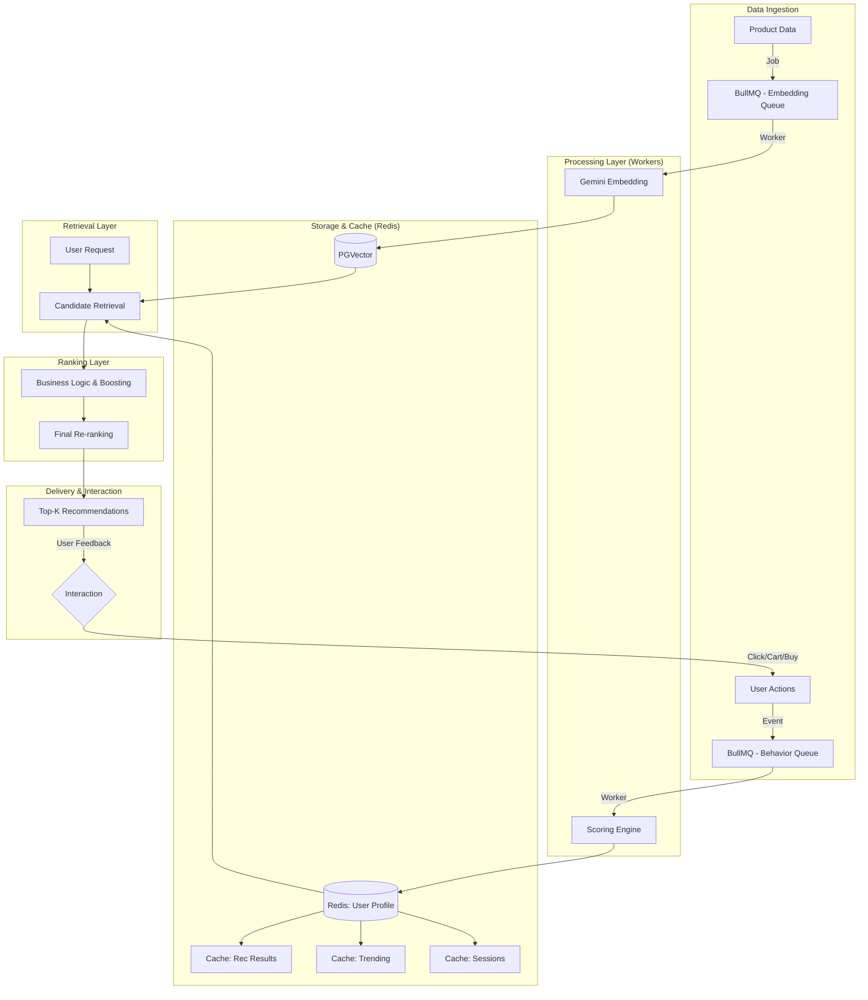
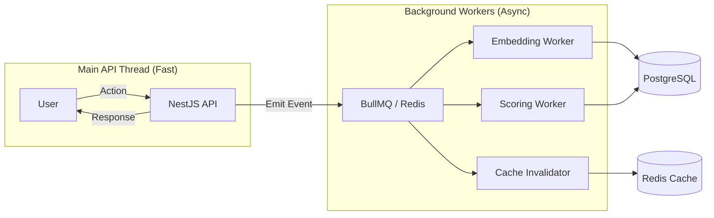
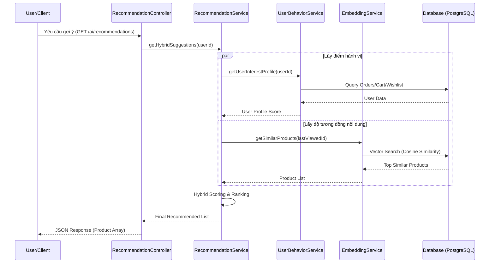

# Hệ thống Gợi ý Sản phẩm Lai (Hybrid Recommendation System) - SneakFreak

## 1. Tổng quan
Trong đồ án **SneakFreak**, hệ thống AI không chỉ dừng lại ở một Chatbot hỗ trợ mà được phát triển thành một **Hệ thống Gợi ý Sản phẩm Lai (Hybrid Recommendation System)**. Mục tiêu là cá nhân hóa trải nghiệm người dùng, giúp họ tìm thấy sản phẩm yêu thích một cách nhanh chóng và chính xác nhất dựa trên cả đặc điểm sản phẩm và hành vi cá nhân.

---

## 2. Phân định vai trò: AI Layer vs. LLM Layer

Một điểm quan trọng trong đồ án là việc phân định rõ ràng giữa tầng logic AI nội tại và việc sử dụng các mô hình ngôn ngữ lớn (LLM). Hệ thống **không** chỉ đơn thuần là một "wrapper" gọi API mà là một kiến trúc AI hoàn chỉnh.

| Thành phần | Vai trò của LLM (Gemini) | Vai trò của SneakFreak AI System |
| :--- | :--- | :--- |
| **Dữ liệu (Data)** | **Semantic Encoding:** Chuyển đổi mô tả sản phẩm sang Vector. | **Feature Engineering:** Thiết kế cấu trúc dữ liệu, nhãn và thuộc tính sản phẩm. |
| **Logic (Algorithm)** | **Embedding Generation:** Cung cấp mô hình toán học để tạo vector. | **Recommendation Logic:** Thuật toán Hybrid, Scoring Engine, Candidate Retrieval. |
| **Xếp hạng (Ranking)** | Không tham gia. | **Ranking Layer:** Kết hợp Business Logic (Stock, Sale, Popularity) để xếp hạng. |
| **Cá nhân hóa** | Không tham gia. | **Personalization:** Theo dõi hành vi người dùng, quản lý Feedback Loop và cập nhật Profile. |

---

## 3. Kiến trúc Kỹ thuật Chi tiết (AI Pipeline)

Hệ thống AI được thiết kế theo mô hình Pipeline khép kín từ khâu thu thập dữ liệu đến khi đưa ra kết quả gợi ý.

### A. AI Pipeline Architecture
Sơ đồ dưới đây mô tả các giai đoạn chính của dữ liệu trong hệ thống AI:

---

## 4. Kiến trúc Xử lý Bất đồng bộ (Asynchronous & Event-Driven)

Để đảm bảo trải nghiệm người dùng mượt mà, hệ thống tách biệt hoàn toàn luồng xử lý nghiệp vụ chính và luồng xử lý AI thông qua cơ chế hướng sự kiện (Event-Driven).

### A. Sơ đồ tách biệt luồng (Decoupling)

### B. Lợi ích của kiến trúc này
1.  **Non-blocking:** Người dùng không phải chờ AI tính toán xong mới nhận được phản hồi (ví dụ: Thêm vào giỏ hàng chỉ mất vài ms).
2.  **Fault Tolerance:** Nếu Worker gặp sự cố, luồng mua hàng chính vẫn hoạt động bình thường. Worker có thể thử lại (Retry) sau đó.
3.  **Scalability:** Có thể tăng số lượng Worker độc lập với API Server khi lượng dữ liệu AI tăng đột biến.

---

## 5. Luồng dữ liệu & Dịch vụ (Flows)

### A. Data Flow (Luồng dữ liệu)
Luồng di chuyển của dữ liệu từ khi người dùng tương tác đến khi nhận được gợi ý:

1.  **Event Capture:** Người dùng thực hiện hành động (Xem, Mua, Thích) trên Web App.
2.  **API Ingestion:** NestJS API nhận request, thực hiện tác vụ nghiệp vụ và gửi sự kiện sang AI Module.
3.  **Vector Processing:** 
    *   Nếu là sản phẩm mới: Chuyển text sang Vector via Gemini.
    *   Nếu là hành vi: Cập nhật "User Interest Profile".
4.  **Similarity Search:** Khi cần gợi ý, hệ thống thực hiện truy vấn Vector (Cosine Similarity) trong PostgreSQL để tìm các bản ghi gần nhất.
5.  **Ranking & Filtering:** Trộn kết quả và trả về cho Client.

### B. Service Flow (Luồng dịch vụ)
Sự tương tác giữa các service nội bộ trong NestJS:

---

## 6. Kiến trúc Hệ thống Hybrid (Nguyên lý)

Hệ thống kết hợp hai phương pháp tiếp cận phổ biến nhất trong AI Recommendation:

### A. Content-Based Filtering (Gợi ý dựa trên nội dung)
- **Cơ chế:** Phân tích các đặc tính vật lý và phi vật lý của sản phẩm (tên, mô tả, màu sắc, phong cách, chất liệu).
- **Công nghệ:** Sử dụng **Vector Embeddings** thông qua Gemini AI hoặc các mô hình mã hóa ngôn ngữ để chuyển đổi thông tin sản phẩm thành các vector toán học.
- **Tính năng liên quan:** 
    - **Visual Search:** Tìm kiếm sản phẩm bằng hình ảnh (đã triển khai).
    - **Similar Products:** Gợi ý các sản phẩm có "khoảng cách vector" gần nhất với sản phẩm đang xem.

### B. Behavior-Based Filtering (Gợi ý dựa trên hành vi)
- **Cơ chế:** Phân tích các hành động của người dùng (Implicit Feedback) thay vì chỉ dựa trên đánh giá sao (Explicit Feedback).
- **Dữ liệu đầu vào:**
    - Lịch sử đơn hàng (`Orders`).
    - Sản phẩm trong giỏ hàng (`Carts`).
    - Sản phẩm trong danh sách yêu thích (`Wishlists`).
    - Lịch sử xem sản phẩm và đánh giá (`Reviews`).

---

## 7. Quy trình Xử lý (Workflow)

### Bước 1: Thu thập & Số hóa dữ liệu (Data Ingestion)
- Mỗi khi một sản phẩm mới được tạo hoặc cập nhật, hệ thống sẽ gọi `EmbeddingService` để tạo ra một **Product Embedding** và lưu vào bảng `product_embeddings`.
- Hệ thống ghi nhận mọi hành vi của người dùng (thêm vào giỏ, yêu thích, mua hàng) vào database.

### Bước 2: Tính toán điểm số (Scoring Engine)
Hệ thống tính điểm quan tâm của người dùng đối với từng thuộc tính sản phẩm:
- **Mua hàng:** +10 điểm.
- **Thêm vào giỏ hàng:** +5 điểm.
- **Thêm vào yêu thích:** +3 điểm.
- **Xem sản phẩm:** +1 điểm.

### Bước 3: Thuật toán Trộn (Hybrid Logic)
Công thức tính điểm gợi ý cơ bản ($S_{base}$):
$$S_{base} = \alpha \cdot S_{content} + \beta \cdot S_{behavior}$$

### Bước 4: Lớp Xếp hạng & Tối ưu (Ranking Layer)
Sau khi có danh sách ứng viên từ bước 3, hệ thống áp dụng các trọng số kinh doanh (Business Boosting) để đưa ra kết quả cuối cùng:

1.  **Popularity Score:** Tăng điểm cho các sản phẩm có `totalSold` cao hoặc đang là xu hướng.
2.  **Inventory Score:** 
    *   Giảm điểm các sản phẩm sắp hết hàng (Stock < 5).
    *   Ẩn các sản phẩm hết hàng (Stock = 0).
3.  **Flash Sale Boost:** Ưu tiên các sản phẩm đang có chương trình khuyến mãi hoặc giảm giá sâu.

Công thức cuối cùng:
$$S_{final} = S_{base} \cdot (1 + \sum Boost)$$

---

## 8. Tối ưu hiệu năng với Redis & BullMQ

Để đảm bảo hệ thống có khả năng phản hồi nhanh (Latency thấp) và xử lý tải lớn, Redis và BullMQ đóng vai trò xương sống trong kiến trúc AI.

### A. Vai trò của Redis (Multi-purpose Cache)
Không chỉ đơn thuần là cache kết quả, Redis được sử dụng cho 4 mục đích chiến lược:
1.  **Recommendation Result Cache:** Lưu trữ kết quả gợi ý cuối cùng cho từng User (TTL 30-60 phút) để tránh tính toán lại nhiều lần.
2.  **Trending Products Storage:** Lưu trữ danh sách sản phẩm xu hướng được tính toán định kỳ, giúp truy xuất với tốc độ O(1).
3.  **Session-based Context:** Lưu trữ hành vi trong phiên làm việc hiện tại của người dùng chưa đăng nhập để đưa ra gợi ý ngay lập tức.
4.  **Behavior Buffering:** Lưu trữ tạm thời các hành vi click/view trước khi đồng bộ vào Database chính.

### B. Xử lý bất đồng bộ với BullMQ (Queue Worker)
Việc gọi API AI (Gemini) hoặc tính toán Vector rất tốn tài nguyên và thời gian. Hệ thống sử dụng BullMQ để:
- **Queue Embedding Jobs:** Khi thêm 100 sản phẩm mới, hệ thống đẩy vào hàng đợi và xử lý dần thông qua Worker, đảm bảo không treo API chính.
- **Background Scoring:** Việc cập nhật điểm hành vi người dùng được xử lý ngầm, không làm chậm trải nghiệm mua sắm của khách hàng.

---

## 9. Vòng lặp phản hồi (Feedback Loop) & Continuous Learning

Để hệ thống luôn "thông minh" và cập nhật theo thời gian thực, một vòng lặp phản hồi (Feedback Loop) được thiết lập để thu thập dữ liệu từ mọi tương tác của người dùng.

### A. Các sự kiện kích hoạt (Triggers)
Hệ thống lắng nghe 3 sự kiện chính từ người dùng:
1.  **Click (Xem sản phẩm):** Quan tâm ở mức độ cơ bản.
2.  **Add to Cart (Thêm vào giỏ):** Quan tâm ở mức độ cao, có ý định mua.
3.  **Purchase (Mua hàng):** Sự xác nhận cao nhất về sở thích và sự hài lòng.

### B. Quy trình cập nhật (Continuous Learning)
Sau mỗi lần một sự kiện trên xảy ra, hệ thống tự động thực hiện các cập nhật sau:
- **Cập nhật Behavior Score:** Điều chỉnh lại trọng số trong "User Interest Profile" của người dùng đó ngay lập tức.
- **Làm mới Recommendation Cache:** Xóa hoặc cập nhật lại bộ nhớ đệm (Redis) các sản phẩm gợi ý cho người dùng này để phản ánh sở thích mới nhất.
- **Cập nhật Trending Products:** Tích lũy dữ liệu vào bảng thống kê toàn hệ thống để cập nhật danh sách "Sản phẩm đang được quan tâm nhất" (Global Popularity).

---

## 10. Cấu trúc Database liên quan (Prisma Schema)

Hệ thống dựa trên các bảng chính sau:
- `ProductEmbedding`: Lưu trữ vector 768 hoặc 1536 chiều của sản phẩm.
- `VisualSearchQuery`: Lưu trữ lịch sử tìm kiếm bằng hình ảnh của người dùng.
- `Order`, `OrderItem`: Dữ liệu chuyển đổi (conversion) cao nhất.
- `CartItem`, `WishlistItem`: Dữ liệu về ý định mua hàng.
- `Review`: Dữ liệu về mức độ hài lòng.

---

## 11. Giải quyết bài toán "Cold Start"

Vấn đề "Cold Start" xảy ra khi hệ thống không có đủ dữ liệu để đưa ra gợi ý (Người dùng mới hoặc Sản phẩm mới). Hệ thống Hybrid của SneakFreak giải quyết vấn đề này như sau:

### A. Đối với Sản phẩm mới (New Item)
- **Vấn đề:** Chưa có ai mua hoặc xem, nên thuật toán Behavior-based không thể gợi ý.
- **Giải pháp:** Sử dụng **Content-based Filtering**. Ngay khi sản phẩm được tạo, Vector Embedding đã được sinh ra. Hệ thống có thể gợi ý sản phẩm này dựa trên độ tương đồng với các sản phẩm cũ hoặc hiển thị trong mục "Sản phẩm tương tự".

### B. Đối với Người dùng mới (New User)
- **Vấn đề:** Hệ thống chưa biết sở thích cá nhân của người dùng.
- **Giải pháp:** 
    - **Popularity-based:** Hiển thị các sản phẩm "Best Seller" hoặc "Trending" (dựa trên bảng `Product` trường `totalSold`).
    - **Contextual-based:** Gợi ý dựa trên sản phẩm họ đang xem ngay tại phiên làm việc đó (Session-based) bằng cách dùng chính sản phẩm đó để tìm các sản phẩm tương đồng.

### C. Đối với Hệ thống mới (New System)
- **Vấn đề:** Cả người dùng và sản phẩm đều mới.
- **Giải pháp:** Sử dụng các bộ lọc mặc định theo danh mục (Category) hoặc thương hiệu (Brand) cho đến khi tích lũy đủ dữ liệu hành vi.

---

## 12. Đánh giá hiệu quả (Evaluation Metrics)

Để biết hệ thống AI thực sự mang lại giá trị, chúng ta cần theo dõi và đo lường thông qua các chỉ số Key Performance Indicators (KPIs) sau:

### A. Chỉ số về Tương tác (Engagement Metrics)
1.  **CTR (Click Through Rate):** Tỉ lệ người dùng click vào các sản phẩm được gợi ý trên tổng số lần hiển thị gợi ý. Chỉ số này phản ánh mức độ hấp dẫn và phù hợp của sản phẩm được gợi ý.
2.  **Average Session Duration:** Thời gian trung bình người dùng ở lại trang web. Gợi ý tốt sẽ giúp giữ chân người dùng lâu hơn bằng cách đưa họ từ sản phẩm này sang sản phẩm khác.

### B. Chỉ số về Chuyển đổi (Business Metrics)
1.  **Add-to-cart Rate (từ Recommendation):** Tỉ lệ người dùng thêm sản phẩm vào giỏ hàng trực tiếp từ danh sách gợi ý.
2.  **Conversion Rate (CR):** Tỉ lệ người dùng thực hiện mua hàng từ các gợi ý của AI. Đây là chỉ số quan trọng nhất để đánh giá hiệu quả kinh tế.

### C. Chỉ số Kỹ thuật (Technical Metrics)
1.  **Recommendation Accuracy (Precision/Recall):** Đo lường mức độ chính xác của thuật toán trong việc dự đoán sản phẩm mà người dùng thực sự sẽ tương tác.
2.  **Latency:** Thời gian phản hồi của API gợi ý (mục tiêu < 200ms nhờ Redis).

---

## 13. Lộ trình Triển khai (Roadmap)

### Giai đoạn 1: Nền tảng (Đã hoàn thành)
- [x] Thiết lập hạ tầng lưu trữ Vector trong PostgreSQL.
- [x] Triển khai `EmbeddingService` cơ bản.

### Giai đoạn 2: Hiệu năng & Hàng đợi (Đang thực hiện)
- [ ] Cấu hình **BullMQ** cho các tác vụ Background AI.
- [ ] Mở rộng **Redis** để quản lý Trending và Session-based gợi ý.

### Giai đoạn 3: Phân tích & Tích hợp (Sắp tới)
- [ ] Hoàn thiện `UserBehaviorService`.
- [ ] Tích hợp UI cho "Similar Products" và "For You".

---

## 14. Lợi ích cho Đồ án

1.  **Tính sáng tạo:** Áp dụng công nghệ Vector Search (PGVector) và Hybrid AI tiên tiến.
2.  **Kỹ năng xử lý hệ thống lớn:** Sử dụng **Message Queue (BullMQ)** và **Advanced Redis Usage** thể hiện tư duy thiết kế hệ thống có khả năng chịu tải cao (High Scalability).
3.  **Khả năng mở rộng:** Kiến trúc Worker tách biệt giúp hệ thống hoạt động ổn định dù dữ liệu lớn.
4.  **Giá trị thực tế:** Một hệ thống AI "Real-time" thực thụ với độ trễ cực thấp.
